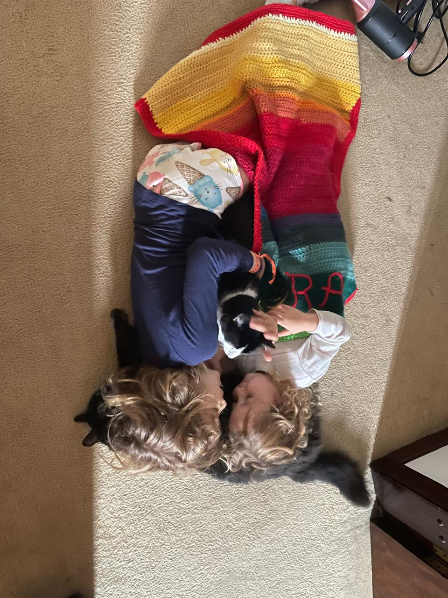
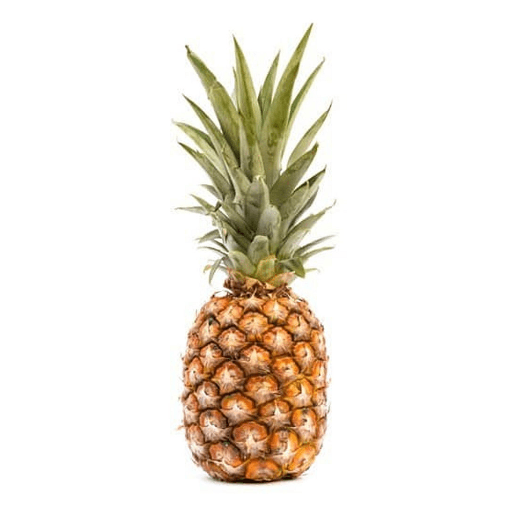

## Quarto

Para obter mais informações, visitar o site <https://quarto.org>.

O cabeçalho yalm define o [tema](https://quarto.org/docs/output-formats/html-themes.html), o estilo, fonte, table of contents, etc...

Identação é feita utilizando o símbolo `#` sendo a quantidade referente a subseções. Assim `#` corresponde ao título mais abrangente, `##` corresponde a um subtítulo, `###` a um sub-subtítulo e assim sucessivamente

# Título maior gigante

## Título normal

### subtítulo menorzim

# Inserir um link

Duas maneiras com resultados diferentes, sendo o primeiro com a palavra que levará ao link entre colchetes **\[\]** e o endereço desejado entre parênteses **()** e a segunda forma, onde todo o endereço irá aparecer, quando colocado entre **\<\>**

[Google](http://google.com) ou <http://google.com>

## Tipos de ênfase e formatação

Uma palavra em **negrito** e uma em *italico*.

Vamos destacar um texto `muito importante` que deve ser destaque

```         
Aqui a gente pode escrever qualquer coisa
Inclusive codigos do R - mas eles nao vao rodar
x<- 2 + 2
```

### Fazer uma lista com sub-itens não numérica:

-   Coisas para aprender antes de morrer
    -   Linguagens
        -   R
        -   Phyton
        -   C++
        -   JavaScript

### Inserir um bloco de notas:

Quando se coloca **\>** antes do texto ele fica destacado como bloco de notas

> Esse vai ser um *bloco de notas*
>
> Pode escrever o que quiser aqui
>
> > colocar sub-itens também é possível e `fica bonitinho`

### Inserir caixas de dicas, warnings, etc.

Várias informações em relação a sintaxe do texto são descritas em blocos definidos por **:::** no início seguidas de callout-note, -tip ou warning, e **:::** ao final.

::: callout-note
Essa é uma caixa de **aviso**!
:::

::: callout-tip
Essa é uma *dica*
:::

::: callout-warning
Essa é uma caixa de **ATENÇÃO**!
:::

Para dar seu próprio nome em português por exemplo colocar o título depois de **\##**

::: callout-tip
## Atenção - MUITO IMPORTANTE

Você é capaz \<3
:::

# Imagens

O markdown entende imagem quando temos uma exclamação seguida do endereço

## Importação simples de arquivos do seu computador

Colocar a legenda entre colchetes e endereço do arquivo entre parênteses. Pode-se definir o tamanho com *{width = xx%}* em relação ao tamanho proporcional a figura original. Também pode ser definido um tamanho específico em inches *{width = xin}* ou milímetros *{width = xx}*

{width="100mm"}

## Direto de um link

{width="55%"}

## Copiando e colando diretamente no editor visual

Note que essa opção vai salvar a figura numa pasta no seu computador e direcionar para ela

{width="50%"}

## Associando figura com link

[](https://pt.wikipedia.org/wiki/Anan%C3%A1s)

# Códigos

Usa-se **\`\`\` {r}** para delimitar os blocos de códigos - pode-se fazer de forma mais rápida com o botão

```{r}
x <- 2+2

x
```

## Gráficos

Vamos fazer um gráfico usando um dataset sobre emissões de C por ano, para isso, vamos importar os dados:

```{r}
#| output: false

emissions <- readr::read_csv('https://raw.githubusercontent.com/rfordatascience/tidytuesday/master/data/2024/2024-05-21/emissions.csv')
```

Fazer o gráfico simples

```{r}
names(emissions)
plot(emissions$total_emissions_MtCO2e~emissions$year)
```

Para inserir a legenda e informações relativas a figura (como tamanho, etc), usa-se o símbolo **#\|** no início do código.

```{r}
#| fig-cap: "Figura 1. Emissão de C por ano"
#| out-width: 50%
#| code-fold: true

plot(emissions$total_emissions_MtCO2e~emissions$year)
```

# Equações

As equações no Quarto são escritas com a linguagem LaTeX (assim como no RMarkdown).

Para que a equação apareça no meio do texto, devemos escrevê-la entre dois cifrões: $2pi*r^2$

Para ficarem destacadas no texto:

$$RE = (1- \frac{Nut_{old}}{Nut_{mat}}  MLCF)*100$$

# Tabelas

Tem vários jeitos, veja [aqui](https://quarto.org/docs/authoring/tables.html), mas vou mostrar usando um pacote para isso, o kableExtra que - eu acho - deixa bem bonitinho. Tambem tem como inserir igual no word usando o visual.

Da mesma forma que os gráfico, usa-se **#\|** seguido das opções diversas para tabelas

```{r}
#| tbl-cap: "Tabela 1. Estrutura dos Dados"
#| output: false
#| warning: false

library(kableExtra)

tab <- kable(head(emissions))

kable_styling(tab, full_width = F, bootstrap_options = c("striped", "hover", "condensed"))
```

# Fazendo abas

Para fazer abas usa-se **::: panel-tabset**

::: panel-tabset
## Figura

```{r}
#| fig-cap: "Figura 2. Entidades responsáveis pelas emissões"

freq <- table(emissions$parent_entity)
barplot(freq)
```

## Tabela

```{r}
#| tbl-cap: "Tabela 2. Dataset"

kable(head(emissions))
```
:::

# Agora é só explorar!

Existe uma infinidade de opções e formatações e tipos de documentos, basta querer aprofundar o conhecimento e não desistir perante as dificuldades.
